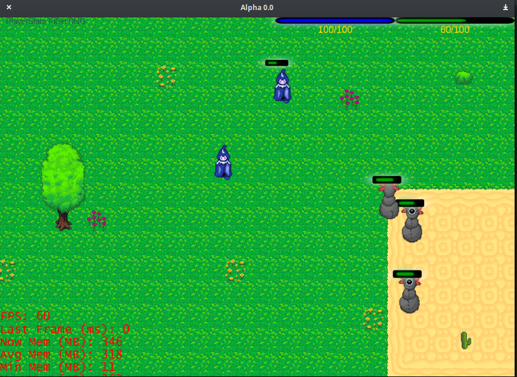

Alpha Online
----

State
----
All in a prototype state, only tested with up to 8 players. More testing is needed. Alpha Online is a 2d multiplayer rpg-like fighting game. Art is mostly placeholders for now; there is not audio yet either.

AO is not cheat proof, but uses an authorative, dedicated  server. 

Network
- Can handle logins(no db) and disconnects
- Syncs player movement with client interpolation
- Syncs npc movement with client interpolation
- Syncs game objects
- In-game chat
- Player inventory
- Basic queueing system that can store messages until the client is ready to accept them
- Basic projectile system with client side prediction

Running
----
Make sure you have all the dependencies. If you do not use java version 1.8, you will run into dependency problems for javafx. You will need to run AO using version 1.8 until alpha supports javafx 11.

Dependencies
----
- javafx - this should be from the jdk, javafx 11 not yet supported
- kyronet - networking library included
- fxgl - java game library included

If you're on windows, you may need to allow it to pass through the firewall.

